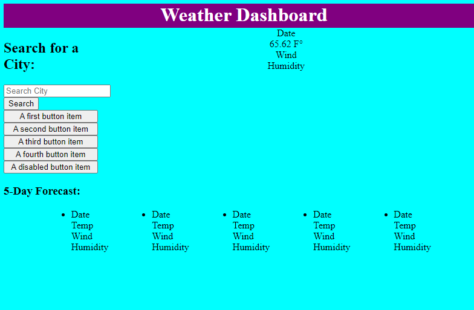

# weekly-weather-dashboard

## Description 

In this challenge, we built a weather dashboard that runs in the browser and features dynamically updated HTML and CSS. We utilized third party API's to provide current weather and 5 day forecast data.

## Usage

[Click here for live website](https://jjsdunc88.github.io/weekly-weather-dashboard/)

## Credits

I worked with tutors Andres Long & Patrick Lakes to gain a better understanding of API calls & JavaScript to work through problems presented in this challenge.

## License

Please refer to the LICENSE in the repo.